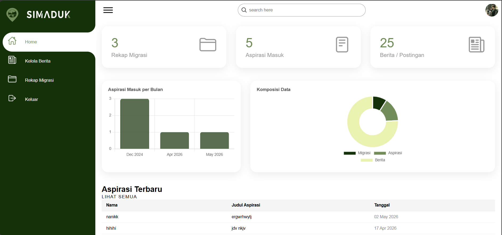

# SIMADUK

Sistem Informasi Migrasi dan Aspirasi Penduduk berbasis web yang dikembangkan menggunakan Native PHP untuk membantu pengelolaan data penduduk, berita desa, dan layanan aspirasi masyarakat.

## Short Description

Web-based village information system built using Native PHP for managing resident migration data, village news, and community aspirations.

---

# Overview

SIMADUK (Sistem Informasi Migrasi dan Aspirasi Penduduk) adalah sistem informasi berbasis web yang dibuat untuk membantu proses pengelolaan data penduduk dan komunikasi masyarakat dengan pihak desa.

Sistem ini memiliki dua jenis pengguna utama:

* Admin / Staff Desa
* Masyarakat Umum

Admin memiliki akses untuk mengelola data dan informasi desa, sementara masyarakat dapat melihat informasi desa serta mengirimkan aspirasi secara online.

---

# Main Features

## Authentication System

* Login system for admin access
* Restricted access for protected pages
* Public and admin page separation

## Village News Management

Admin dapat:

* Menambahkan berita desa
* Mengedit berita
* Menghapus berita
* Melihat riwayat berita

Berita yang dipublikasikan akan tampil pada halaman utama website.

## Resident Data Management

Admin dapat:

* Menambahkan data penduduk
* Mengedit data penduduk
* Menghapus data penduduk

Semua data dikelola secara manual melalui dashboard admin.

## Migration Data Management

Terdapat fitur pengelolaan data migrasi penduduk yang hanya dapat diakses oleh admin.

## Community Aspiration Service

Masyarakat dapat mengirimkan aspirasi atau masukan melalui fitur layanan aspirasi yang tersedia pada website.

## Public Information Page

Halaman utama website menampilkan:

* Berita terbaru desa
* Aspirasi masyarakat
* Struktur organisasi desa
* Lokasi desa
* Informasi umum lainnya

---

# Technologies Used

* Native PHP
* MySQL
* HTML
* CSS
* JavaScript

---

# Project Notes

This project was developed during the early learning phase of web development using Native PHP.

The system focuses on understanding:

* CRUD operations
* Authentication basics
* Data management flow
* Role separation between public users and admin
* Basic web application structure

Although the system still uses manual data input and simple architecture, this project became an important foundation in learning backend and web application development.

---

# Screenshots

## Login Page

## Admin Dashboard

## Public Homepage

---

# Key Highlights

* Built using Native PHP
* Simple admin authentication system
* CRUD functionality implementation
* Village information management
* Community aspiration feature
* Beginner backend project experience

---

# Collaboration

This project was developed collaboratively by a small team.

- Liana Syifa Fauzia handled backend development, application logic, and several frontend sections.
- Ririn focused on developing the main public interface.
- Hani contributed to frontend implementation and interface support.
