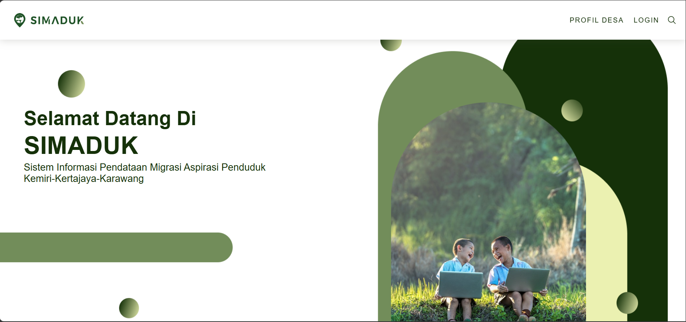
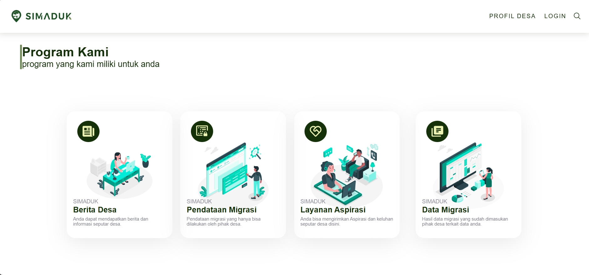
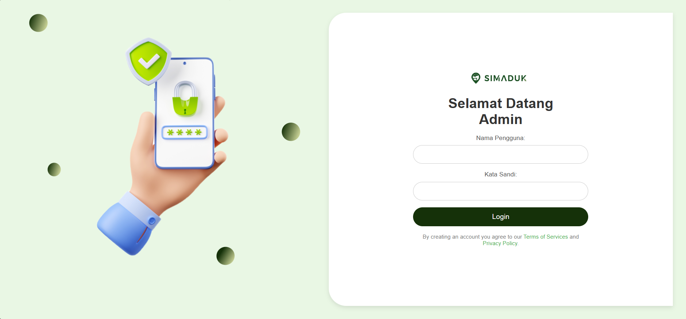

# SIMADUK

SIMADUK is a village information system website built using PHP Native and MySQL.

## Features
- News management
- Public aspiration form
- Admin dashboard
- CRUD functionality

## Technologies
- PHP Native
- MySQL
- HTML
- CSS
- JavaScript

## Screenshots

### Home Page

### Main Features

### Admin Dashboard

### Admin Login Page

## Developer
- Liana Syifa Fauzia (liana9597)
- Ririn Dwi Ariyanti (ririndaaa21)
- Hani Ayu Fadila (Haniayu2345)
